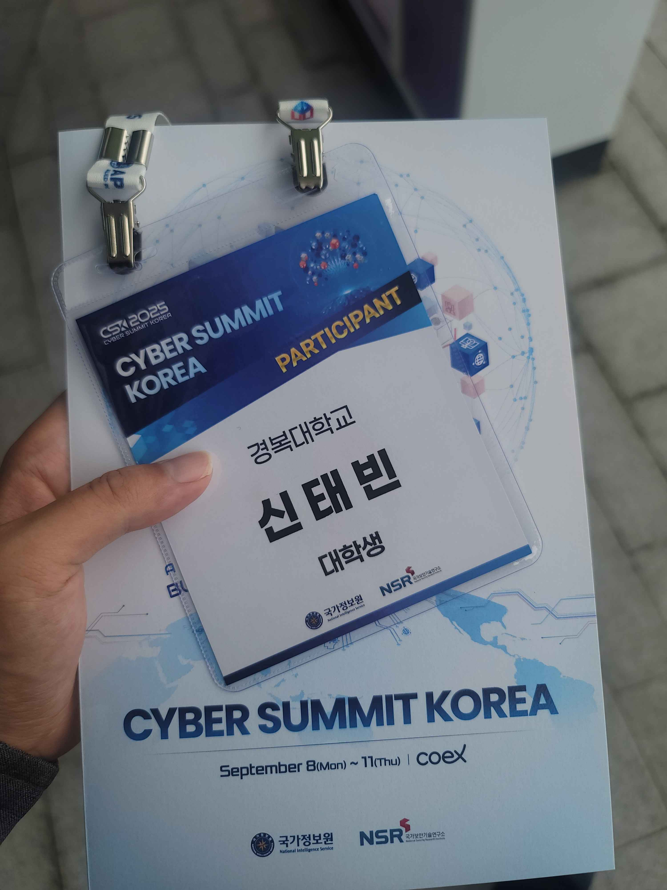

# Cyber-Summit-Korea-2025
국가정보원과 국가보안기술연구소에서 개최하는 서울(코엑스)「Cyber Summit Korea 2025」참여 후기

[Cyber Summit Korea 2025 참가 인증]

## 📋 행사 개요

**행사명**: Cyber Summit Korea 2025  
**주최**: 국가정보원, 국가보안기술연구소  
**일시**: 2025년 9월 8일(월) - 9월 11일(목)  
**장소**: COEX, 서울  
**참가 형태**: 컨퍼런스 참관 및 전시 부스 방문

## 🎯 참가 목적

- 최신 사이버보안 기술 동향 파악
- 국내외 보안 전문가들의 인사이트 습득
- 보안 업계 네트워킹 및 취업 정보 수집
- 실무진들의 경험담 및 기술적 노하우 학습

## 📅 주요 프로그램 참석 내역

### Day 1 (9월 8일)
- **09:50-12:00**: 비공개 세션 (국제정보교류협의회)
- **12:00-18:00**: APEX 컨퍼런스 및 전시 부스 탐방
  - 오리엔테이션 및 사전등록
  - 전시 부스 방문 및 기업 담당자와의 대화

### Day 2 (9월 9일) - 메인 컨퍼런스
- **09:50-10:30**: 기조연설1 - "From Legislation to Resilience: The Future of Cybersecurity in Czechia"
  - 연사: Lukáš Kintr (체코 국가사이버보안청장)
- **10:30-11:10**: 개회식
- **11:10-11:50**: 기조연설2 - "AI 시대의 사이버보안"
  - 연사: 정병덕 (서울과학기술대 연구교수)
- **13:30-15:00**: 전문 세션 참관
  - **세션1**: AI 안보 (산기평 보안실 - 401호)
  - **세션2-1**: 국가 안보 위협 (새롬기술 외 - 317호)
  - **세션3-1**: 국제 사이버 안보전략과 협력 (호주국가대학교 - 318호)
- **15:20-16:00**: 기조연설3 - Félix Barrio (스페인 국가사이버보안청장)
- **16:00-17:30**: 전문 세션 참관
  - 국가 안보를 위한 도심 해킹방어 상시 혁신 기술 및 정책
  - 국가 인프라 관점에서의 융합된 보안

## 🏢 전시 부스 탐방 기업

방문한 주요 보안 기업 및 기관:

1. **엔가화이트햇** - 모의해킹 및 보안컨설팅
2. **안랩** - 통합보안솔루션 
3. **LG네스원** - 보안시스템 통합
4. **LG CNS** - IT서비스 및 보안솔루션
5. **네이버클라우드** - 클라우드 보안
6. **한국전력공사** - 전력인프라 보안
7. **지니언스(주)** - 영상보안솔루션
8. **국가보안기술연구소** - 국가차원 보안연구
9. **윈스테크넷** - 네트워크보안
10. **에스투더블유** - 보안솔루션
11. **휴네시온** - 정보보안서비스

## 💡 주요 학습 내용 및 인사이트

### 기술적 인사이트
- **AI와 사이버보안의 융합**: AI 기술이 사이버 위협 탐지와 대응에 미치는 혁신적 영향
- **국가 인프라 보안**: 전력, 통신 등 핵심 인프라의 사이버 보안 중요성
- **제로트러스트 아키텍처**: 차세대 보안 패러다임의 실무 적용 사례
- **클라우드 보안 전략**: 하이브리드 클라우드 환경에서의 보안 고려사항

### 업계 동향
- 사이버보안 전문가 수요 급증
- 실무 경험과 인증의 중요성 증대
- 국제협력을 통한 글로벌 보안 대응 필요성
- 법제도와 기술의 균형적 발전 방향

## 🔗 네트워킹 및 커리어 인사이트

### 전문가 멘토링
- 보안업계 선배들과의 대화를 통한 커리어 경로 탐색
- 실무진들이 권하는 핵심 역량: 기술력 + 소통능력 + 지속적 학습
- 신입 개발자가 갖춰야 할 보안 마인드셋과 실무 스킬

## 🏆 참가 의의

이번 Cyber Summit Korea 2025 참가를 통해 한국 사이버보안 생태계의 현황과 미래 방향성을 체감할 수 있었습니다. 특히 AI 기술과 보안의 융합, 국가 차원의 사이버보안 정책, 그리고 실무진들의 생생한 경험담은 향후 보안 전문가로서의 커리어 방향을 설정하는 데 매우 유익했습니다.

단순한 참관을 넘어서, 업계 전문가들과의 직접적인 소통과 최신 기술 동향 파악을 통해 실무 역량 향상에 대한 구체적인 로드맵을 수립할 수 있었습니다.

---

**참가 인증**: 행사 참가증, 명찰, 기념품 등 보관  
**추가 자료**: 발표 자료집, 기업 부스 브로슈어, 네트워킹 명함 등

> 본 문서는 개인 포트폴리오 및 학습 기록 용도로 작성되었습니다.  
> 문의사항: root.bin.vi@gmail.com
