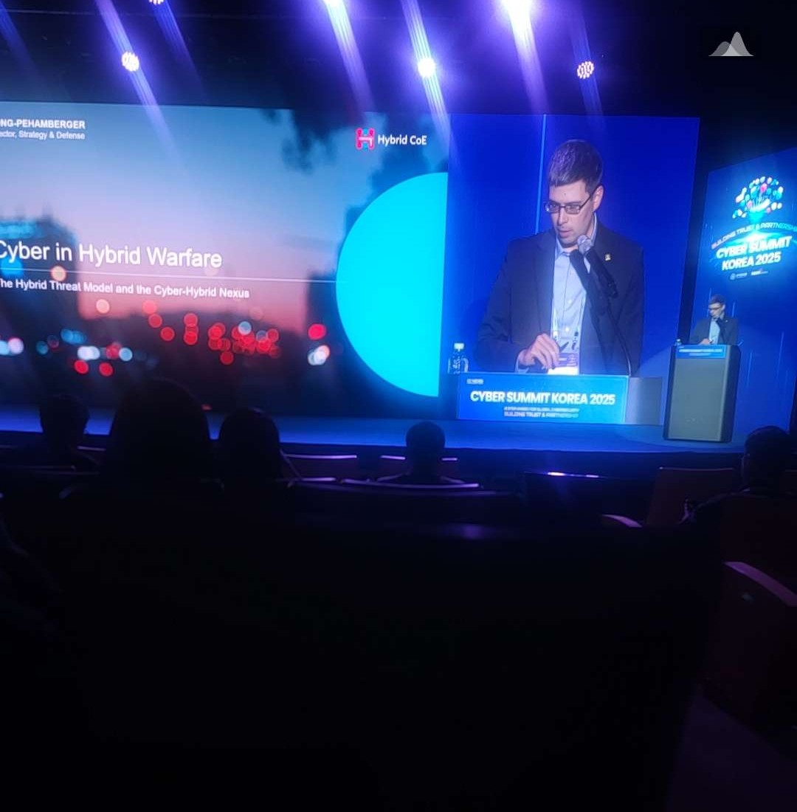

# Cyber Summit Korea 2025 - AI 안보 세션 참가 후기

## 📋 세션 개요

**세션명**: AI 안보 
**장소**: COEX 401호  
**일시**: 2025년 9월 9일(화) 13:30-15:00  
**참가자**: 하이브리드 위협대응센터 부국장, 신준호 AI융합 시험연구소 단장, 기타 전문가들

---

## 🎯 주요 발표 내용 및 인사이트

### 1. Cyber Defense in the Context of Hybrid Threats (David Song-Pehamberger)
**발표자**: EU 하이브리드 위협대응센터 부국장

#### 핵심 내용
- **하이브리드 공격의 확산**: 온라인과 오프라인을 결합한 복합적 공격 양상이 증가
- **다양한 도메인 공격**: 사이버 공간뿐만 아니라 물리적 공간을 포함한 전방위적 위협
- **국가별 위협 현황**: 러시아와 중국이 주요 하이브리드 공격 국가로 지목

#### 기술적 배경
하이브리드 위협은 **군사적 수단과 비군사적 수단을 결합**하여 상대국의 정치적 정당성을 훼손하고 사회 혼란을 유발하는 전술이다[22][25]. 2022년 러시아-우크라이나 전쟁에서 러시아는 우크라이나 정부 기관과 은행 웹사이트에 디도스 공격을 감행하며 **사이버 공간과 물리적 공간을 동시에 공격**하는 하이브리드 전쟁을 시연했다[22].

**최신 위협 동향**:
- 국가 사이버 안보센터(NCSC) 발표에 따르면 한국을 겨냥한 사이버공격의 **80%가 북한발**, 중국(5%), 러시아(4%) 순으로 나타났다[22]
- 중국과 연계된 해커그룹이 한국 외교부를 해킹하여 외교 공무원의 이메일 계정을 수집한 사례가 확인됐다[22]

---

### 2. AI 신뢰, 안전 및안보 동향과 시사점  
**발표자**: 신준호 TTA AI융합 시험연구소 단장

#### 핵심 발표 내용
- **ISO/IEC 23894:2023 표준**: AI 시스템의 인지 능력과 자율성 평가 기준 제시
- **세이프가드 알고리즘**: AI 모델의 안전성을 보장하기 위한 기술적 방안
- **AI를 통한 정보 탈취 공격**: 대화형 AI를 악용한 새로운 형태의 사이버 공격 가능성
- **4단계 준비태세 평가**: 훈련-중간점검-평가-개선의 순환적 안전성 관리 체계

#### 기술적 배경
**ISO/IEC 23894:2023**은 AI를 개발·생산·배포하거나 AI를 활용한 제품·시스템·서비스를 사용하는 조직이 **AI와 관련된 위험을 관리**할 수 있도록 핵심 임무들을 제시하고 위험관리 절차를 안내한다[23]. 

**AI 신뢰성 평가 기준**:
- **인지성(Awareness)**: AI가 환경과 상황을 올바르게 인식하는 능력
- **자율성(Autonomy)**: 인간의 개입 없이 독립적으로 의사결정을 수행하는 능력
- **안전장치**: 모델 공격에 대한 방어 대책 및 안전 모드 구현[23][26]

**주요 안전성 특성**: 설명가능성, 투명성, 제어가능성, 회복탄력성, 안정성, 강건성, 예측가능성, 보안성, 공정성, 프라이버시, 안전성, 책임성[23]

---

## 🚀 미래기술 보안 세션 (세션 1-2)

### 3. 국가 안보를 위한 도청 불가능한 양자 통신 기술이 현황 및 전망 
**발표자**: 윤천주 ETRI 본부장

#### 핵심 발표 내용
- **원거리 양자 얽힘 기술**: 기존보다 더 먼 거리에서 양자 얽힘을 통한 통신 기술 개발 중
- **양자 키 분배(QKD)**: 해킹이 불가능한 암호화 통신 방식의 지속적 발전
- **국제 경쟁 현황**: 중국의 양자위성, 미국의 양자 드론 등 선진국들의 적극적 투자
- **상용화 전망**: **2035년 양자 컴퓨터 개발 예상 시기가 점점 앞당겨지고 있음**

#### 기술적 배경
**양자 얽힘(Quantum Entanglement)**은 두 개 이상의 광자가 거리와 상관없이 서로 연관된 양자 상태를 갖는 현상이다[27]. ETRI는 2024년 **광자 8개를 제어할 수 있는 8큐비트 양자 칩**을 개발하고 6큐비트 양자 얽힘 현상을 확인했다[27][33].

**최신 기술 성과**:
- **얽힘 광자 장거리 전송**: 2024년 실환경망 포함 유선 100km 이상 전송 성공[36]
- **양자 암호통신의 안전성**: 외부 해킹이 불가능하여 금융, 정부, 의료 분야에서 높은 응용 가능성[24]
- **글로벌 개발 현황**: IBM은 2033년까지 **10만 큐비트 규모의 모듈형 양자 슈퍼컴퓨터** 개발 계획 발표[44]

**양자컴퓨터 상용화 전망**:
- 전문가의 83%가 **2035년 이전에 양자 유용성 실현** 가능하다고 응답[44]
- 양자 기술은 2035년까지 **최대 1조 3,000억 달러의 경제적 가치** 창출 예상[47][50]

---

### 4. 인공위성통신 관련 사이버보안
**발표자**: 윤지원 고려대학교 교수

#### 핵심 발표 내용
- **위성 해킹의 현실성**: 기지국 또는 위성 자체를 대상으로 한 해킹 사례 증가
- **위성 간 공격**: 향후 위성과 위성 간 상호 해킹 시도 가능성
- **보안 인식 부족**: 인공위성 통신 보안이 상대적으로 덜 주목받는 문제
- **포괄적 보안 전략**: 지상국-위성-사용자 전 구간의 통합 보안 대책 필요성

#### 기술적 배경
**인공위성 사이버 위협의 현실화**가 급속히 진행되고 있다. 대표적 사례들:

**실제 해킹 사례**:
- **2007-2008년 NASA 위성 해킹**: 중국 군 당국 해커들이 랜드샛-7호와 테라 AM-1호 위성을 해킹하여 운영 중단[42][45]
- **2022년 비아샛 해킹**: 러시아 해커가 우크라이나 침공 당일 위성 통신망을 마비시킨 사례[42]
- **2024년 한국 국가위성운영센터 해킹**: 북한으로 추정되는 세력이 제주도 국가위성운영센터를 공격[42]

**위성 보안 위협 유형** (NIST IR 8270 기준)[46][51]:
- **A**: 센서 데이터 재밍 및 스푸핑
- **B**: 센서 데이터 가로채기 및 도청  
- **C**: 센서 시스템 고의적 손상
- **D**: 서비스 거부 공격
- **E**: 가이던스 제어 재밍 및 스푸핑
- **F**: 가이던스 제어 하이재킹 및 무단 명령
- **G**: 악성코드 삽입
- **H**: 가이던스 서비스 거부 공격

**위성 해킹의 파급효과**:
- **군사 정보 탈취**: 국가 안보 관련 민감 정보 유출[43]
- **민간 서비스 마비**: GPS, 통신, 방송 서비스 중단[43]
- **경제적 손실**: 항법 시스템 교란으로 인한 교통·물류 혼란[43]

---

## 💡 종합 분석 및 인사이트

### 기술 융합의 가속화
1. **AI와 사이버보안의 결합**: AI 기술이 사이버 위협 탐지와 대응에 혁신적 변화를 가져오고 있으나, 동시에 AI를 악용한 새로운 공격 벡터도 등장
2. **양자 기술의 실용화**: 이론적 개념에서 벗어나 실제 산업 현장에서 활용 가능한 수준으로 발전
3. **우주 사이버보안의 중요성**: 위성 의존도 증가에 따른 새로운 보안 영역의 부상

### 국가 간 기술 경쟁 심화
- **하이브리드 위협**: 러시아, 중국, 북한 등이 전통적 사이버 공격을 넘어선 복합적 위협 전술 구사
- **양자 기술 패권**: 미국, 중국, 유럽 간 양자 컴퓨터 개발 경쟁 가속화
- **우주 안보**: 위성 기술이 국가 안보의 핵심 요소로 부상

### 보안 패러다임의 전환
- **사전 예방적 접근**: 기존 대응 중심에서 예측·예방 중심으로 전환
- **전방위 보안**: 사이버-물리-우주 공간을 아우르는 통합 보안 전략 필요
- **국제 협력**: 글로벌 위협에 대응하기 위한 국제적 협력 체계 구축 중요성

---

## 🔮 향후 전망 및 시사점

### 단기 전망 (2025-2030)
- **AI 안전성 표준**: ISO/IEC 23894:2023 등 국제 표준의 본격적 적용
- **양자 통신 상용화**: 금융, 정부 부문에서 양자 암호통신 도입 확산
- **위성 보안 규제**: 각국 정부의 위성 사이버보안 규제 강화

### 중장기 전망 (2030-2035)
- **양자 컴퓨터 실용화**: 2035년경 실제 산업 문제 해결 가능한 양자 유용성 달성
- **하이브리드 위협 고도화**: AI와 양자 기술을 활용한 차세대 하이브리드 공격 등장
- **우주 인터넷**: 위성 기반 글로벌 인터넷 서비스의 본격적 상용화

### 한국의 대응 방향
1. **기술 자립**: 핵심 보안 기술의 국산화 및 기술 주권 확보
2. **인재 양성**: AI, 양자, 우주 보안 분야 전문가 육성
3. **국제 협력**: 글로벌 보안 생태계에서의 적극적 역할 수행
4. **법제도 정비**: 새로운 기술 환경에 맞는 보안 규제 체계 구축

---

**참가 소감**: 이번 AI 안보 세션을 통해 사이버보안 분야가 AI, 양자, 우주 기술과 어떻게 융합되고 있는지 체감할 수 있었습니다. 특히 이론적 수준에 머물던 기술들이 실제 보안 위협과 대응 방안으로 구체화되는 과정이 인상적이었으며, 향후 보안 전문가로서 준비해야 할 역량과 방향성을 명확히 할 수 있었습니다.

> 본 문서는 개인 학습 및 포트폴리오 목적으로 작성되었으며, 공개된 발표 내용과 공식 자료를 바탕으로 정리했습니다.
